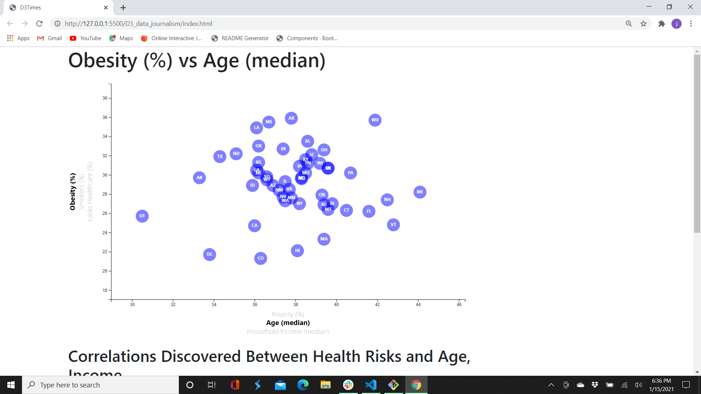

# D3-Challenge


## Background

Welcome to the newsroom! I just accepted a data visualization position for a major metro paper. I was tasked with analyzing the current trends shaping people's lives, as well as creating charts, graphs, and interactive elements to help readers understand my findings.

The editor wants to run a series of feature stories about the health risks facing particular demographics. She's counting on you to sniff out the first story idea by sifting through information from the U.S. Census Bureau and the Behavioral Risk Factor Surveillance System.

The data set included with the assignment is based on 2014 ACS 1-year estimates from the [US Census Bureau](https://data.census.gov/cedsci/).  The current data set includes data on rates of income, obesity, poverty, etc. by state. MOE stands for "margin of error."



## Code Samples

The program starts of with a predetermined selected X and Y axis selection (chosenXAxis, chosenYAxis).
```
            var chosenXAxis = "poverty";
            var chosenYAxis = "healthcare";

Two dictionaries are utilized which hold the key for each of the X and Y axis selections:
```
            var xAxisDict = {
                "poverty":"Poverty (%)",
                "age":"Age (median)",
                "income":"Household Income (median)"
            };

            var yAxisDict = {
                "obesity":"Obesity (%)",
                "smokes":"Smokers (%)",
                "healthcare":"Lacks Healthcare (%)"
            };

As selections are made on either the X or Y axis, functions are called to:

* Change the scatterplot title.
* Set the scale for the X or Y axis according which is selected.
* render the Axis depending on which selected.
* render the datapoints for the new selection.
* label the datapoints for the new selection.
* render new descriptions for each datapoint through the updateToolTip function.